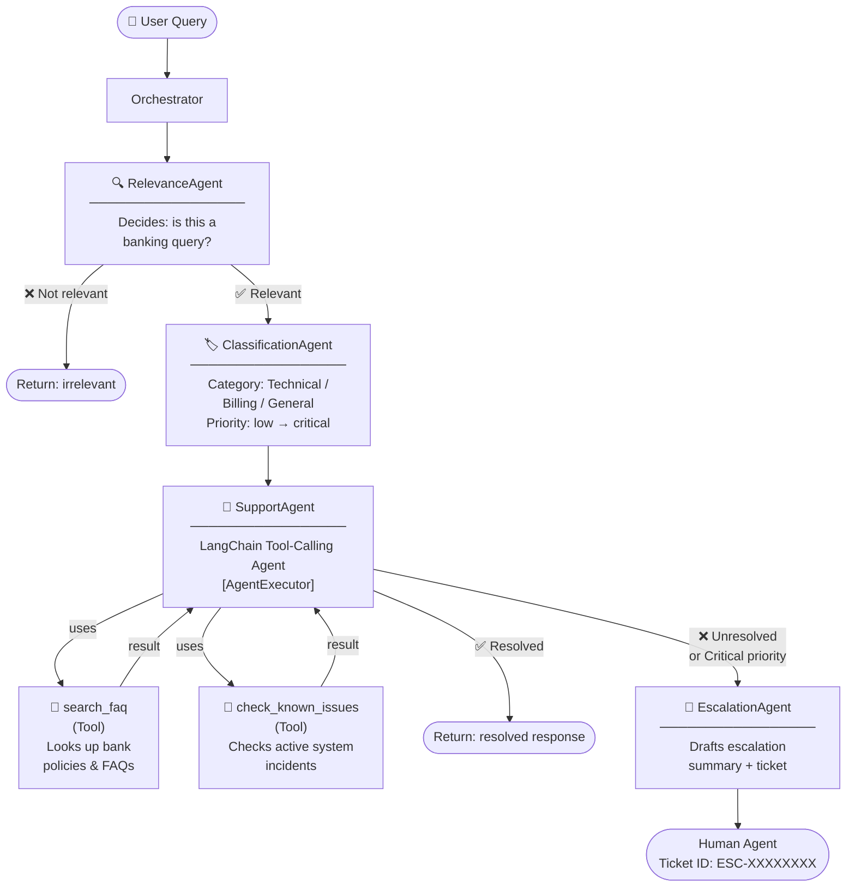

# Multi-Agent Bank Support System — Architecture

## System Flow Diagram



## Agent Responsibilities

| Agent | Input | Output | LangChain Pattern |
|---|---|---|---|
| **RelevanceAgent** | Raw user query | `{relevant, reason}` | Prompt + `with_structured_output` |
| **ClassificationAgent** | Bank query | `{category, priority, summary}` | Prompt + `with_structured_output` |
| **SupportAgent** | Query + category + priority | `{response, resolved, tools_used}` | `create_tool_calling_agent` + `AgentExecutor` |
| **EscalationAgent** | Query + support context | `{ticket_id, message, action, urgency}` | Prompt + `with_structured_output` |

## Tools (integrated into SupportAgent)

| Tool | Purpose | Trigger condition |
|---|---|---|
| `search_faq` | Retrieves relevant bank FAQ answers | Policy, procedure, or general questions |
| `check_known_issues` | Looks up active system incidents | Technical complaints (app, card, login) |

---

## Monitoring & Evaluation

### Why Monitoring Matters
In a production multi-agent system, silent failures are the biggest risk: an agent may return a
confident-sounding response that is factually wrong, classify a critical issue as low priority, or
call tools repeatedly without converging. Without monitoring you have no visibility into these
failures until a customer complains or revenue is impacted.

### What to Monitor

| Signal | Metric | Alert threshold |
|---|---|---|
| **Latency** | p50/p95/p99 per agent and end-to-end | p95 > 5s |
| **Escalation rate** | % of relevant queries that escalate | > 30% may indicate prompt regression |
| **Tool call rate** | % of support calls that invoke a tool | Sudden drop → tool not being used |
| **Classification distribution** | Breakdown across technical/billing/general | Large unexpected shift |
| **Error rate** | LLM timeouts, JSON parse failures, tool errors | > 1% |
| **Token usage** | Per-agent and total tokens per request | Cost and quota management |

### Recommended Stack
- **LangSmith** — native LangChain tracing: captures every agent step, tool call, and LLM input/output.
  Set `LANGCHAIN_TRACING_V2=true` + `LANGCHAIN_API_KEY` and all runs are automatically traced.
- **Prometheus + Grafana** — instrument latency, escalation rate, and error rate as custom metrics.
- **Structured logging** — emit JSON logs per request (request_id, status, category, priority,
  tools_used, latency_ms) and ship to a log aggregator (Datadog, CloudWatch, etc.).

### Why Evaluation Matters
Evaluation is the only way to know whether a prompt change improved or regressed the system.
Without it, every deployment is a gamble. It also enables regression detection: if a new LLM
version changes classification behaviour, a test suite catches it before it reaches production.

### How to Evaluate This System

1. **Relevance Agent** — labelled dataset of ~200 queries (100 banking, 100 unrelated).
   Metric: accuracy, precision, recall. Target: > 95% accuracy.

2. **Classification Agent** — labelled dataset with ground-truth category + priority per query.
   Metric: macro F1 across categories; priority ordinal MAE.

3. **Support Agent** — human evaluation rubric (1–5) on: accuracy, helpfulness, tone.
   Also measure tool invocation correctness (did it call the right tool for the query type?).

4. **End-to-end** — escalation rate, time-to-resolution, simulated customer satisfaction score.
   Use an LLM-as-judge framework (e.g., `langchain_benchmarks`) to score responses at scale.

5. **Regression suite** — 50 golden queries with expected status (resolved/escalated) run on
   every deployment via CI. Block deploys that regress by > 2%.
```
